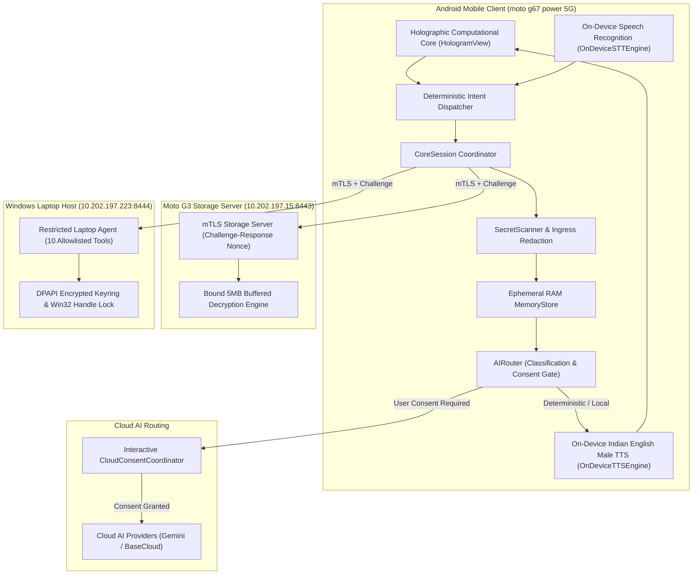

# ASHWIN — Autonomous Security-First Holographic Assistant

ASHWIN is a voice-first personal assistant and multi-device private computation network designed with an uncompromising, fail-closed security architecture. It pairs an Android mobile device with a private encrypted Motorola storage endpoint and a restricted Windows laptop host.

---

## Architectural Overview



---

## Security Model & Frozen Specification

ASHWIN is formally governed by the authoritative specification [`ASHWIN_Security_Specification_v1.0.1.md`](file:///c:/Users/banaj/OneDrive/Desktop/ASHWIN/ASHWIN_Security_Specification_v1.0.1.md).

* **Frozen Specification SHA-256**:
  `D6B4C52E7AFF5C60F8A088E94D06829CFDF67CFEDF0FBE275EDBC16507007C36`
* **Four Data Classifications**:
  1. `PUBLIC`: General non-sensitive queries and public facts.
  2. `PROTECTED`: Personal documents, filenames, and emails. Gated behind user consent.
  3. `HIGHLY_PROTECTED`: Passwords, authentication keys, and recovery codes. **Strictly blocked from model and memory context (RULE-03).**
  4. `SYSTEM_INTERNAL`: Session IDs, challenge nonces, and certificates.
* **Fail-Closed Boundaries**: All endpoints, routers, and tools default to rejecting execution upon authentication failure, packet corruption, missing consent tokens, or unverified file handles.

---

## Implementation Status by Phase

| Phase / Module | Component Description | Current Implementation Status |
| :--- | :--- | :--- |
| **Phase 1** | Security Specification & Threat Model | **Complete** (All 57 specification invariant tests pass). |
| **Phase 2** | Moto G3 Encrypted Storage Server | **Complete** (mTLS challenge-response protocol, 5MB buffering). |
| **Phase 3** | Android Mobile Client & Holographic HUD | **Complete & Verified on Hardware** (Single-screen holographic HUD, `en-in-x-ene-local` TTS voice, `SpeechNormalizer`, edge-to-edge system insets). |
| **Phase 3 (AI Providers)**| On-Device & Cloud AI Abstractions | **Architectural Stubs**: `LocalAIProvider` operates in deterministic offline mode; `GeminiCloudProvider` and `CloudAIProvider` enforce CredentialStore credential binding and router authorization boundaries rather than live cloud inference. |
| **Phase 4** | Windows Restricted Laptop Endpoint | **Complete** (Explicit 10-tool restriction, DPAPI credential storage, single-handle Win32 file verification). |

---

## Running the Automated Test Suite

### Python Test Suite (177 Tests)
```bash
# Run the complete test runner
python run_tests.py

# Or via standard unittest discovery
python -m unittest discover tests -v
```

### Static Analysis & Linter
```bash
# Verify zero undefined typing names or syntax errors
python -m pyflakes ashwin tests
```

### Multi-Platform Notes & Testing Environments
- **Windows OS**: Production environment for `WindowsLaptopAgent`. Uses native Win32 APIs (`CryptProtectData`, `CryptUnprotectData`, `CreateProcessW`, `GetFileInformationByHandle`).
- **Linux / macOS**: Non-Windows environments will run POSIX-compatible modules (`ashwin.core`, `ashwin.moto_endpoint`). Tests requiring native Win32 process execution and DPAPI are decorated with `@unittest.skipUnless(sys.platform == "win32")`.
- **Insecure DPAPI Simulation Flag**: DPAPI identity storage strictly refuses to store plaintext on non-Windows platforms. For isolated non-Windows unit testing environments where DPAPI simulation is required, the environment variable `ASHWIN_ALLOW_INSECURE_TEST_DPAPI=1` must be explicitly set.


### Android Application Build
```bash
# Windows
android_app\run_gradle_build.bat

# Linux / macOS
cd android_app && ./gradlew assembleDebug
```

---

## Repository Structure

```
ASHWIN/
├── ashwin/
│   ├── core/               # Core Session, Router, Secret Scanner, Memory Store
│   ├── moto_endpoint/      # Moto G3 Storage Server & mTLS Connector
│   └── laptop_agent/       # Windows Restricted Laptop Agent (10 Tools)
├── android_app/            # Native Kotlin Android Application
│   └── app/src/main/
│       ├── AndroidManifest.xml
│       ├── java/org/ashwin/core/
│       │   ├── HologramView.kt         # Futuristic Holographic HUD
│       │   ├── MainActivity.kt         # Edge-to-Edge System Insets & Touch HUD
│       │   ├── OnDeviceTTSEngine.kt    # Offline Indian English Male Voice
│       │   ├── SpeechNormalizer.kt     # Spoken Token Text Normalizer
│       │   └── CoreSession.kt          # Security Boundary Enforcement
│       └── res/
├── tests/                  # Complete 177-test regression suite
├── .github/workflows/      # GitHub Actions Multi-OS CI Workflow
├── ASHWIN_Security_Specification_v1.0.1.md
├── run_tests.py
└── README.md
```
